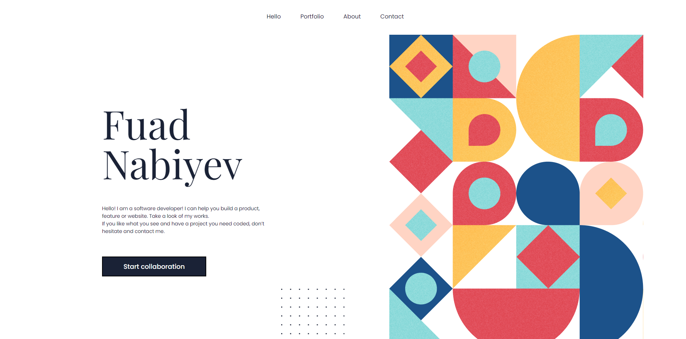

# 

# Portfolio

## Built With

- HTML
- CSS
- JavaScript

## Live Demo

[Github Pages Link](https://fuadnabi.github.io/My-Portfolio/)

### Setup
If you want to try this application locally, follow the steps below:

1. Clone the project using git clone `git@github.com:FuadNabi/My-Portfolio
.git`.

2. Run `cd My-Portfolio`.

3. Run `npm install`.

4. Run `npm start`.

## Authors

👤 **Fuad Nabiyev**

- GitHub: [@github](https://github.com/FuadNabi)
- LinkedIn: [@linkedin](https://www.linkedin.com/in/fuad-nabiyev/)

## 🤝 Contributing

Contributions, issues, and feature requests are welcome!

Feel free to check the [issues page](https://github.com/FuadNabi/My-Portfolio/issues).

## Show your support

Give a ⭐️ if you like this project!

## Acknowledgments

- Hat tip to anyone whose code was used
- Inspiration
- etc

## 📝 License

This project is [MIT](https://github.com/FuadNabi/setup-and-mobile-first/blob/highlight/LICENSE) licensed.

_NOTE: we recommend using the [MIT license](https://choosealicense.com/licenses/mit/) - you can set it up quickly by [using templates available on GitHub](https://docs.github.com/en/communities/setting-up-your-project-for-healthy-contributions/adding-a-license-to-a-repository). You can also use [any other license](https://choosealicense.com/licenses/) if you wish._
